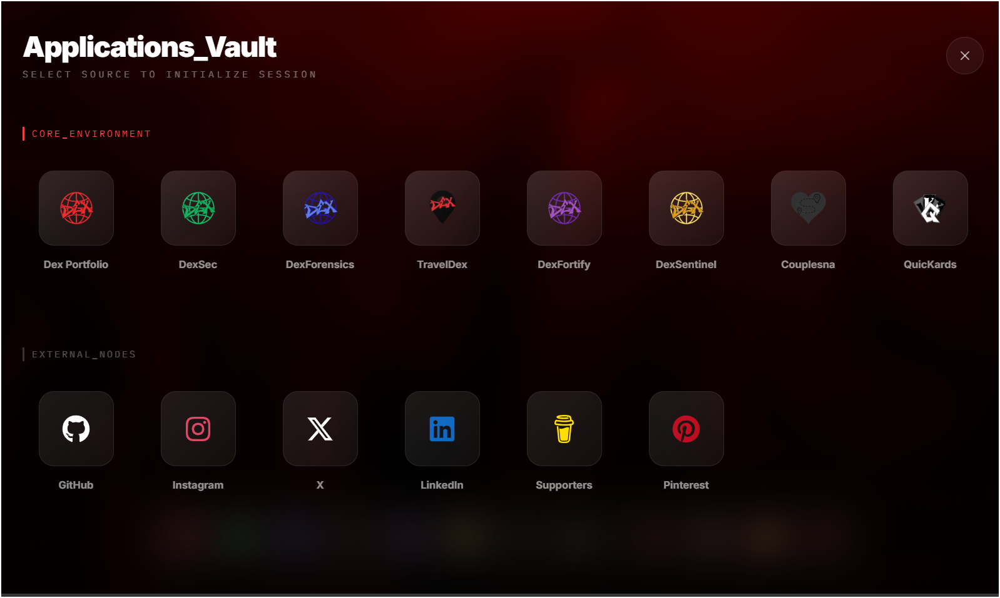

# DexOS: Integrated Security Suite



DexOS is a high-fidelity, immersive security operating system interface designed for the **iamdex** ecosystem. It provides a centralized dashboard for accessing tactical security tools including DexSec, DexForensics, DexFortify, and DexSentinel.

## 🚀 Live Demo
Access the live environment at: [https://dexos.iamdex.codes](https://dexos.iamdex.codes)

## 🛠 Tech Stack
- **Framework**: Next.js 15 (App Router)
- **Styling**: Tailwind CSS
- **Animations**: Framer Motion
- **Icons**: Lucide React
- **Language**: TypeScript

## 🖥 Features
- **Immersive OS Interface**: Lockscreen, Homescreen, Dock, and Launchpad.
- **Terminal Integration**: Built-in terminal simulation for system interactions.
- **Dynamic Theming**: Adaptive accent colors based on the active security application.
- **Responsive Design**: Fully optimized for mobile and desktop "operating system" experience.
- **Keyboard Shortcuts**:
  - `Alt + T`: Open Terminal
  - `Alt + S`: Open Settings
  - `Ctrl + K`: Toggle Launchpad
  - `Esc`: Close all windows

## 📡 API Instructions
DexOS uses internal mock APIs to serve system status and application data.

### Get Applications
`GET /api/dexos/apps`
Returns a list of integrated security applications and their status.

### Get System Stats
`GET /api/dexos/stats`
Returns real-time metrics for the suite.

## 📦 Installation & Local Development

1. **Clone the repository**:
   ```bash
   git clone https://github.com/iamdex/DexOS.git
   ```

2. **Install dependencies**:
   ```bash
   npm install
   ```

3. **Run the development server**:
   ```bash
   npm run dev
   ```

4. **Build for production**:
   ```bash
   npm run build
   ```

## 📄 License
This project is part of the iamdex ecosystem. All rights reserved.
